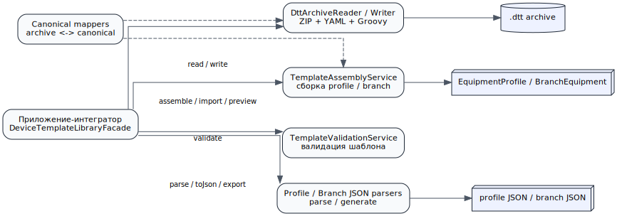
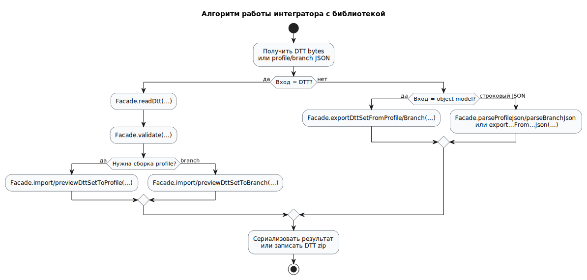
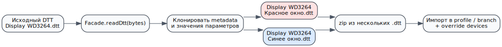
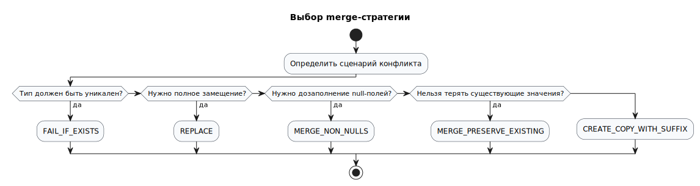

# DeviceTypesImportExport

Репозиторий содержит стартовую реализацию multi-module проекта для работы с `.dtt` (один тип устройства в одном архиве).

## Модули

- `device-template-library` — библиотека импорта/экспорта и сборки profile JSON.
- `device-template-demo-service` — demo-модуль на Micronaut 4.x.

## Что реализовано

### 1) Сборка profile JSON из нескольких шаблонов

В библиотеке реализованы:

- API `TemplateAssemblyService`;
- preview API `TemplateAssemblyService` (`previewEquipmentProfile`, `previewBranchEquipment`);
- DTO сборки профиля (`EquipmentProfileAssemblyRequest`, `EquipmentProfileDeviceTypeRequest`, `TemplateValueOverride`);
- merge-стратегии:
  - `FAIL_IF_EXISTS`
  - `REPLACE`
  - `MERGE_NON_NULLS`
  - `MERGE_PRESERVE_EXISTING`
  - `CREATE_COPY_WITH_SUFFIX`
- `DefaultTemplateAssemblyService`.

### 2) Базовый DTT archive I/O (YAML внутри ZIP)

Добавлены:

- `DttArchiveWriter` / `DefaultDttArchiveWriter`;
- `DttArchiveReader` / `DefaultDttArchiveReader`;
- archive DTO:
  - `DttArchiveDescriptor`
  - `DttArchiveTemplate`
- сервисы верхнего уровня:
  - `DeviceTypeTemplateExportService`
  - `DeviceTypeTemplateImportService`
- диагностичное исключение `DttFormatException`.
- диагностичные исключения сервисов импорта/экспорта:
  - `TemplateImportException`
  - `TemplateExportException`
- валидация Groovy-скриптов через `TemplateValidationService` (`DefaultTemplateValidationService`) с диагностикой по пути скрипта.

Внутри архива пишутся YAML-файлы (`manifest.yml`, `template/*.yml`) и Groovy-скрипты (`scripts/*.groovy`, `scripts/event-handlers/*.groovy`, `scripts/commands/*.groovy`).

### 3) Deterministic archive output

`DefaultDttArchiveWriter` формирует детерминированный ZIP:

- фиксированный порядок записи;
- фиксированный timestamp `ZipEntry`.

Это упрощает git-diff и автоматические проверки байтовой стабильности.


### 5) Branch equipment JSON и JSON parser/generator

Добавлены модели и сервисы для полного JSON уровня отделений:

- `BranchEquipment`, `BranchNode`, `BranchDeviceType`, `DeviceInstanceTemplate`;
- сборка через `TemplateAssemblyService#assembleBranchEquipment(...)`;
- `DeviceManagerBranchJsonParser` / `DeviceManagerBranchJsonGenerator`;
- `EquipmentProfileJsonParser` / `EquipmentProfileJsonGenerator`.

Поддержаны сценарии:

- тип устройства без дочерних устройств;
- тип устройства с одним или несколькими устройствами;
- merge-конфликты типов устройств в отделении.


### 6) Canonical internal model (первая итерация)

Добавлены:

- `CanonicalDeviceTypeTemplate`;
- `CanonicalDeviceTypeMetadata`;
- `CanonicalScriptSet`;
- `CanonicalTemplateMapper` / `DefaultCanonicalTemplateMapper` для преобразований `DTT archive DTO <-> canonical`.

На текущем этапе маппер сохраняет Groovy-код и ключевые metadata/schema/default/example поля без потерь.


### 7) Использование библиотеки как зависимости (facade API)

Для удобного программного использования добавлены:

- `DeviceTemplateLibraryFacade`;
- `DefaultDeviceTemplateLibraryFacade`;
- `DeviceTemplateLibrary#createDefaultFacade()`;
- `DeviceTemplateLibrary#createFacadeBuilder()` для подмены реализаций.

Фасад поддерживает методные сценарии:

- read/write DTT bytes;
- validate DTT bytes/template;
- assemble profile/branch модели;
- parse/generate profile/branch JSON.
- batch export/import DTT set из profile (`exportDttSetFromProfile` / `importDttSetToProfile`);
- batch export/import DTT set из branch (`exportDttSetFromBranch` / `importDttSetToBranch`).
- batch import DTT set в уже существующий branch equipment (`importDttSetToExistingBranch`, `importDttBase64SetToExistingBranch`, `importDttZipToExistingBranch`).
- preview-сценарии на уровне библиотеки:
  - profile (`previewDttSetToProfile`, `previewDttBase64SetToProfile`, `previewDttZipToProfile`);
  - branch equipment (`previewDttSetToBranch`, `previewDttBase64SetToBranch`, `previewDttZipToBranch`).
- dual-mode передачи DTT на уровне фасада библиотеки:
  - Base64 (`importDttBase64SetToProfile`, `importDttBase64SetToBranch`, `importDttBase64SetToExistingBranch`);
  - upload-download zip (`importDttZipToProfile`, `importDttZipToBranch`, `importDttZipToExistingBranch`, `exportProfileToDttZip`, `exportBranchToDttZip`);
  - zip+Base64 (`exportProfileToDttZipBase64`, `exportBranchToDttZipBase64`).
- dual-mode JSON на уровне фасада библиотеки:
  - object-model запросы (`ProfileExportRequest`, `BranchEquipmentExportRequest`);
  - string JSON (`exportDttSetFromProfileJson`, `exportDttSetFromBranchJson`) с поддержкой передачи `dttVersion`.

Пример методного использования:

```java
DeviceTemplateLibraryFacade facade = DeviceTemplateLibrary.createDefaultFacade();

DttArchiveTemplate template = facade.readDtt(bytes);
ValidationResult validation = facade.validate(template);
String profileJson = facade.toProfileJson(
        facade.assembleProfile(profileRequest)
);
```

#### Канонический branch JSON (`DeviceManager.json`) и script-секции

Библиотека поддерживает канонические поля branch-уровня для `deviceTypes`:

- `type` (`kind`);
- lifecycle script-секции:
  - `onStartEvent`
  - `onStopEvent`
  - `onPublicStartEvent`
  - `onPublicFinishEvent`
- `eventHandlers`
- `commands`
- `deviceTypeFunctions`

Формат script-секций соответствует канону `DeviceManager.json`:

- объект с полями `inputParameters`, `outputParameters`, `scriptCode` (где применимо);
- для `deviceTypeFunctions` используется строка или `null`.

При `branch JSON -> DTT` библиотека:

- сохраняет Groovy-код в соответствующие script-поля DTT;
- сохраняет `inputParameters`/`outputParameters` в `binding-hints.yml`;
- сохраняет `type` как `bindingHints.deviceTypeKind`.

При `DTT -> branch JSON` библиотека восстанавливает эти поля обратно (включая `kind`, lifecycle, handlers, commands и `deviceTypeFunctions`).

### 4) Demo-service

Добавлен технический endpoint:

- `GET /api/system/health`.
- `POST /api/dtt/validate` (application/octet-stream).
- `POST /api/dtt/inspect` (application/octet-stream).
- `POST /api/dtt/metadata` (application/octet-stream: один `.dtt` или zip c `.dtt` -> список базовых metadata: `id`, `name`, `version`, `description`, `imageBase64`).
- `POST /api/dtt/version/compare?inputVersion=...` (application/octet-stream: сравнение версии из параметра и версии из `.dtt`, возвращает какая версия больше).
- `POST /api/dtt/import/profile` (application/json, Base64 DTT set -> profile JSON).
- `POST /api/dtt/preview/profile` (application/json, Base64 DTT set -> preview profile JSON).
- `POST /api/dtt/preview/profile/detailed` (application/json -> preview profile JSON + расчёт defaults/overrides по типам).
- `POST /api/dtt/import/profile/upload` (application/octet-stream zip с `.dtt` -> profile JSON).
- `POST /api/dtt/preview/profile/upload` (application/octet-stream zip с `.dtt` -> preview profile JSON).
- `POST /api/dtt/export/profile/one` (application/json, profile JSON + `deviceTypeId` -> один Base64 DTT).
- `POST /api/dtt/export/profile/one/download` (application/json, profile JSON + `deviceTypeId` -> бинарный `.dtt`).
- `POST /api/dtt/preview/export/profile/one` (application/json, preview single export из profile JSON с диагностикой конфликтов/ошибок).
- `POST /api/dtt/export/profile/all` (application/json, profile JSON -> Base64 DTT set).
- `POST /api/dtt/export/profile/all/download` (application/json, profile JSON -> zip с `.dtt`).
- `POST /api/dtt/import/branch` (application/json, Base64 DTT set + branchIds -> branch equipment JSON).
- `POST /api/dtt/import/branch/merge` (application/json, Base64 DTT set + existingBranchJson + branchIds -> merge в существующий branch equipment JSON).
- `POST /api/dtt/preview/branch` (application/json, Base64 DTT set + branchIds -> preview branch equipment JSON).
- `POST /api/dtt/preview/branch/detailed` (application/json -> preview branch JSON + расчёт defaults/overrides по `branchId:deviceTypeId`).
- `POST /api/dtt/import/branch/upload` (application/octet-stream zip с `.dtt` + query branchIds -> branch equipment JSON).
- `POST /api/dtt/preview/branch/upload` (application/octet-stream zip с `.dtt` + query branchIds -> preview branch equipment JSON).
- `POST /api/dtt/export/branch/one` (application/json, branch equipment JSON + `deviceTypeId` -> один Base64 DTT).
- `POST /api/dtt/export/branch/one/download` (application/json, branch equipment JSON + `deviceTypeId` -> бинарный `.dtt`).
- `POST /api/dtt/preview/export/branch/one` (application/json, preview single export из branch equipment JSON с merge-диагностикой).
- `POST /api/dtt/export/branch/all` (application/json, branch equipment JSON -> Base64 DTT set, поддерживает фильтры `branchIds` и `deviceTypeIds`).
- `POST /api/dtt/export/branch/all/download` (application/json, branch equipment JSON -> zip с `.dtt`).

Дополнительно: при сборке/экспорте `.dtt` поддерживается иконка типа устройства `icon.png` в корне архива. Если иконка не передана во входном JSON и не найдена в `.dtt`, используется встроенное PNG-изображение по умолчанию (возвращается как `imageBase64`).
- export endpoint-ы поддерживают **оба варианта входа**: типизированные объектные модели (`profile`, `branchEquipment`) и строковые JSON-поля (`profileJson`, `branchJson`).
- для export-сценариев примеры OpenAPI синхронизированы с фактическим поведением парсеров:
  - во входных JSON присутствует корневая агрегированная секция `metadata` (список metadata типов устройств);
  - поддержан вариант с одним элементом `metadata`, если экспортируется один тип устройства.
- для export endpoint-ов можно передать `dttVersion`:
  - версия фиксируется в `manifest.yml` (`deviceTypeVersion`) без изменения версии формата (`formatVersion`);
  - если в metadata типа уже есть версия, библиотека выбирает **большую** между `dttVersion` из запроса и версией из модели;
  - версия добавляется в конец `description` типа устройства;
  - `defaultValues` в DTT берутся из фактических значений параметров типа устройства, переданных в profile/branch JSON.
- metadataJson-примеры для upload endpoint-ов детализированы:
  - `metadataOverride` включает `id/name/displayName/description`;
  - примеры демонстрируют override параметров типа (`deviceTypeParamValues`) и устройств (`devices[].deviceParamValues`);
  - для branch merge-пути показан сценарий merge в существующий JSON с сохранением корневой `metadata`.
- валидатор Groovy дополнительно проверяет наличие domain-context metadata в `bindingHints` для lifecycle/event/command скриптов (помимо синтаксиса).
- `GET /swagger-ui/index.html` (Swagger UI для ручного прогона сценариев).
- `GET /swagger/device-template-demo.yml` (OpenAPI-спецификация demo-service).
- Интеграция demo-service с библиотекой выполняется через DI-бин публичного фасада `DeviceTemplateLibraryFacade` (без ручной сборки core-сервисов в контроллерах/сервисах).
- Контрактные тесты demo-service прогоняют ключевые endpoint-ы на реальных OpenAPI-примерах, чтобы примеры оставались исполнимыми и актуальными при изменениях API.

#### Проверка актуальности OpenAPI примеров (рекомендуемый порядок)

Для этого проекта используйте **Maven Wrapper** (а не Gradle):

```bash
./mvnw -Dmaven.repo.local=.m2/repository clean verify
```

Если нужно ускорить локальную проверку только demo-service контрактов OpenAPI:

```bash
./mvnw -Dmaven.repo.local=.m2/repository \
  -pl device-template-demo-service -am test \
  -Dtest=OpenApiSpecContractTest,DttControllerExamplesContractTest,DttSwaggerExamplesTest \
  -Dsurefire.failIfNoSpecifiedTests=false
```

Что считается обязательным признаком актуальности примеров:

- export profile/branch примеры содержат root `metadata` (список объектов);
- у metadata-объектов заполнен `imageBase64` (PNG Base64);
- `metadataJson` upload-примеры демонстрируют `metadataOverride` и override параметров типов/устройств;
- контрактные тесты проходят без ручных правок примеров.

### 5) Чеклист статуса реализации

#### Уже реализовано

- [x] Базовый формат `.dtt` (YAML + Groovy в ZIP) с детерминированной записью.
- [x] Парсинг/генерация profile JSON и branch equipment JSON.
- [x] Публичный фасад библиотеки + builder.
- [x] API библиотеки покрывает направления:
  - [x] `.dtt -> profile/branch`;
  - [x] `profile/branch -> набор .dtt`;
  - [x] merge-импорт в существующий branch equipment.
- [x] Merge-стратегии поддерживаются в сборке/merge:
  - [x] `FAIL_IF_EXISTS`;
  - [x] `REPLACE`;
  - [x] `MERGE_NON_NULLS`;
  - [x] `MERGE_PRESERVE_EXISTING`;
  - [x] `CREATE_COPY_WITH_SUFFIX`.
- [x] Dual-mode сценарии фасада:
  - [x] Base64 для batch-импорта DTT;
  - [x] zip upload/download для batch-импорта/экспорта DTT;
  - [x] экспорт из object JSON и string JSON.
- [x] Базовое сохранение мета-информации параметров в `deviceTypeParametersSchema` при экспорте в `.dtt`.
- [x] Базовое формирование `exampleValues` при экспорте в `.dtt`.
- [x] Базовое восстановление `items` для `Array`-параметров при экспорте в `.dtt`.
- [x] Базовое заполнение `template-origin.yml` (`sourceKind` + `sourceSummary`) при экспорте в `.dtt`.
- [x] Базовая запись `examples/profile-values-example.yml`, `examples/branch-values-example.yml` и `README-IN-ARCHIVE.md` при экспорте `.dtt`.
- [x] Частично расширена canonical-model прослойка: добавлены типизированные canonical-сущности для parameter schema/origin/values и переведён mapper archive <-> canonical на них.
- [x] Добавлены проверки canonical round-trip для nested schema/items/template-origin и стабилизирован canonical -> archive mapping при `null` value-контейнерах.
- [x] Расширено формирование `manifest.yml` обязательными служебными полями (source/support/script flags, createdBy/createdAt/libraryVersion и др.).
- [x] Импорт `.dtt` в profile/branch восстанавливает parameter-object значения с metadata из схемы (включая nested object/`exampleValue`), а не только «плоские» default values.
- [x] Импорт `.dtt` в profile/branch восстанавливает metadata для `Array` с object-items (nested `items.parametersMap` и `exampleValue` по элементам).
- [x] В сценарии `dtt -> profile -> dtt` явная `items`-схема массива сохраняется (не перетирается inferred-элементами).
- [x] Добавлены canonical profile/branch projection сущности и mapper (`CanonicalProjectionMapper`) для явного слоя canonical -> profile/branch.
- [x] Импорт `dtt -> profile/branch` в фасаде использует canonical projection layer (а не локальный ad-hoc merge восстановление).
- [x] Demo-service, использующий библиотеку через DI-бин фасада.
- [x] Диагностичные исключения импорта/экспорта (`TemplateImportException`, `TemplateExportException`).

#### Осталось реализовать

- [x] Полная «глубокая» canonical-model прослойка (отдельные canonical projection/entity уровни для всех направлений).
- [x] Полное сохранение расширенной мета-информации параметров (`displayName`, `description`, `exampleValue`, nested object/array schema) без деградации во всех round-trip.
- [x] Базовый набор ожидаемых DTO и API-сущностей из AGENTS.md (включая `TemplateParameterSchema`, `TemplateParameterDefinition`, `TemplateScriptSet`, `TemplateDefaultValues`, `ExportResult`, `ImportResult`, `DeviceInstanceValueOverride`).
- [x] Полная детализация YAML-структуры `.dtt` (schema/default/example/origin/binding-hints) для всех export-сценариев.
- [x] Единая структурированная модель ошибок demo-service для всех endpoint-ов.
- [x] Полное покрытие OpenAPI примерами для всех dual-mode комбинаций входа/выхода.

## Maven-окружение в репозитории

В репозитории размещено полноценное Maven-окружение для воспроизводимой сборки:

- Maven Wrapper (`mvnw`, `mvnw.cmd`, `.mvn/wrapper/maven-wrapper.properties`) для запуска без локальной установки Maven;
- `.mvn/maven.config` с настройками batch-режима, отключением progress-шума и фиксированным локальным репозиторием `.m2/repository`;
- `.mvn/jvm.config` с единым `UTF-8` и фиксированной локалью JVM;
- `maven-enforcer-plugin` в root `pom.xml` для обязательных версий Java 17 и Maven 3.9+;
- единая фиксация версий базовых Maven plugins в `pluginManagement` для стабильной multi-module сборки.

Это позволяет одинаково запускать команды локально, в CI и в контейнерных окружениях.


## Рекомендуемые настройки IntelliJ IDEA 2025 (оптимально для этого проекта)

Ниже — практичный baseline для Windows/Linux/macOS, чтобы избежать проблем с `mvnw` и обеспечить повторяемую multi-module сборку.

### 1) Project SDK и язык

- `File -> Project Structure -> Project`:
  - `Project SDK`: **Java 17**;
  - `Project language level`: **17 (SDK default)**.
- `Modules`: убедитесь, что оба модуля (`device-template-library`, `device-template-demo-service`) используют тот же SDK 17.

### 2) Maven в IDEA (ключевой пункт)

- `Settings -> Build, Execution, Deployment -> Build Tools -> Maven`:
  - `Maven home`: **Bundled (Maven 3)** или **Wrapper** (предпочтительно Wrapper);
  - `User settings file`: default;
  - `Local repository`: оставить default;
  - для CLI в этом репозитории отдельный `-Dmaven.repo.local` не требуется (он уже задан в `.mvn/maven.config`).
  - включить `Always update snapshots` только при необходимости.
- `Runner`:
  - `JRE`: **Project SDK (17)**;
  - `VM Options`: `-Dfile.encoding=UTF-8 -Duser.language=ru -Duser.country=RU`;
  - `Environment variables` (Windows): при необходимости явно задать `JAVA_HOME=<путь к JDK 17>`.

> Если в IDEA на Windows появляется ошибка вида `fail to move MAVEN_HOME`/`Cannot start Maven from wrapper`, обычно помогает переключение `Maven home` на **Bundled Maven** и явный выбор `JRE = JDK 17`.

### 3) Делегирование сборки

- `Settings -> Build Tools -> Maven -> Runner`:
  - включить `Delegate IDE build/run actions to Maven` для максимальной близости к CI;
  - либо оставить выключенным для более быстрых локальных инкрементальных сборок (рекомендуется только при понимании отличий от CI).

Для этого репозитория предпочтителен режим с делегированием в Maven.

### 4) Annotation Processing и Micronaut

- `Settings -> Build, Execution, Deployment -> Compiler -> Annotation Processors`:
  - `Enable annotation processing` = **ON**.

Это важно для стабильной генерации Micronaut метаданных в demo-service.

### 5) Код-стиль и импорты

- `Settings -> Editor -> Code Style -> Java`:
  - `Tab size = 4`, `Indent = 4`;
  - `Continuation indent = 8`;
  - line separator `LF` (если команда не требует иного).
- `Settings -> Editor -> Code Style -> Java -> Imports`:
  - использовать `Class count to use import with '*' = 999`;
  - `Names count to use static import with '*' = 999`.

Это снижает шум в diff и делает ревью предсказуемее.

### 6) Рекомендуемые Run Configuration

Создайте Maven-конфигурации из корня репозитория:

1. `clean test (root)`
   - Command line: `clean test`
2. `verify (root)`
   - Command line: `clean verify`
3. `demo test with dependencies`
   - Command line: `-pl device-template-demo-service -am test`

### 7) Что проверить после настройки IDEA

1. Успешный `Reload All Maven Projects`;
2. Успешный запуск `clean test (root)` из IDEA;
3. Отсутствие ошибки резолва `device-template-library:0.1.0-SNAPSHOT` в demo-модуле;
4. Корректная генерация OpenAPI/Micronaut артефактов при сборке.

## Руководство для разработчика, использующего библиотеку

Ниже описана работа именно с `device-template-library` как с встраиваемой Java-библиотекой. Считайте, что вы пишете свою службу-потребитель с нуля и не опираетесь на demo-service. Demo-service полезен только как референсный интеграционный пример и ручной стенд для Swagger UI.

Полная самостоятельная версия руководства вынесена в отдельный документ: [`docs/developer-guide.md`](docs/developer-guide.md).

### Архитектура интеграции

Исходники PlantUML расположены в каталоге [`docs/plantuml`](docs/plantuml), а визуализированные SVG-иллюстрации — в [`docs/plantuml/svg`](docs/plantuml/svg).

#### 1. Архитектура библиотеки



PlantUML: [`docs/plantuml/01-library-architecture.puml`](docs/plantuml/01-library-architecture.puml)

#### 2. Алгоритм интегратора



PlantUML: [`docs/plantuml/02-import-export-algorithm.puml`](docs/plantuml/02-import-export-algorithm.puml)

#### 3. Один DTT → несколько производных типов / наборов устройств



PlantUML: [`docs/plantuml/03-derived-device-types.puml`](docs/plantuml/03-derived-device-types.puml)

#### 4. Выбор merge-стратегии



PlantUML: [`docs/plantuml/04-merge-strategy-choice.puml`](docs/plantuml/04-merge-strategy-choice.puml)

### Быстрый старт для своей службы

#### 1. Подключение зависимости

Если библиотека публикуется в ваш внутренний Maven-репозиторий, прикладной сервису достаточно подключить модуль `device-template-library`:

```xml
<dependency>
    <groupId>ru.aritmos.dtt</groupId>
    <artifactId>device-template-library</artifactId>
    <version>0.1.0-SNAPSHOT</version>
</dependency>
```

#### 2. Инициализация фасада

```java
import ru.aritmos.dtt.api.DeviceTemplateLibrary;
import ru.aritmos.dtt.api.DeviceTemplateLibraryFacade;

DeviceTemplateLibraryFacade facade = DeviceTemplateLibrary.createDefaultFacade();
```

Это основной вход в библиотеку. Если вашей службе нужны подмены сериализаторов, валидаторов или low-level сервисов, используйте `DeviceTemplateLibrary.createFacadeBuilder()`.

### Основные уровни использования библиотеки

#### Уровень A. Low-level: прочитать, проверить, изменить и записать один DTT

Этот уровень нужен, когда ваша служба должна программно модифицировать шаблон, не собирая ещё profile или branch equipment.

```java
import ru.aritmos.dtt.api.DeviceTemplateLibrary;
import ru.aritmos.dtt.api.DeviceTemplateLibraryFacade;
import ru.aritmos.dtt.api.dto.DeviceTypeMetadata;
import ru.aritmos.dtt.api.dto.ValidationResult;
import ru.aritmos.dtt.archive.model.DttArchiveTemplate;

import java.nio.file.Files;
import java.nio.file.Path;
import java.util.LinkedHashMap;
import java.util.Map;

DeviceTemplateLibraryFacade facade = DeviceTemplateLibrary.createDefaultFacade();

byte[] sourceBytes = Files.readAllBytes(Path.of("Display WD3264.dtt"));
DttArchiveTemplate source = facade.readDtt(sourceBytes);

ValidationResult validation = facade.validate(source);
if (!validation.valid()) {
    throw new IllegalStateException("DTT не прошёл валидацию: " + validation.errors());
}

Map<String, Object> patchedDefaults = new LinkedHashMap<>(source.defaultValues());
patchedDefaults.put("TicketZone", "5");

DttArchiveTemplate patched = new DttArchiveTemplate(
        source.descriptor(),
        new DeviceTypeMetadata(
                "display-wd3264-red-window",
                "Display WD3264 Красное окно",
                "Display WD3264 Красное окно",
                "Производный шаблон для красного окна"
        ),
        source.deviceTypeParametersSchema(),
        source.deviceParametersSchema(),
        source.bindingHints(),
        patchedDefaults,
        source.exampleValues(),
        source.templateOrigin(),
        source.onStartEvent(),
        source.onStopEvent(),
        source.onPublicStartEvent(),
        source.onPublicFinishEvent(),
        source.deviceTypeFunctions(),
        source.eventHandlers(),
        source.commands()
);

byte[] patchedBytes = facade.writeDtt(patched);
Files.write(Path.of("Display WD3264 Красное окно.dtt"), patchedBytes);
```

#### Уровень B. Mid-level: собрать профиль оборудования из шаблонов

Этот сценарий подходит, когда ваша служба хранит шаблоны отдельно, а профиль оборудования собирает динамически.

```java
import ru.aritmos.dtt.api.DeviceTemplateLibrary;
import ru.aritmos.dtt.api.DeviceTemplateLibraryFacade;
import ru.aritmos.dtt.api.dto.DeviceTypeMetadata;
import ru.aritmos.dtt.api.dto.DeviceTypeTemplate;
import ru.aritmos.dtt.api.dto.EquipmentProfileAssemblyRequest;
import ru.aritmos.dtt.api.dto.EquipmentProfileDeviceTypeRequest;
import ru.aritmos.dtt.api.dto.MergeStrategy;
import ru.aritmos.dtt.api.dto.TemplateValueOverride;
import ru.aritmos.dtt.json.profile.EquipmentProfile;

import java.util.List;
import java.util.Map;

DeviceTemplateLibraryFacade facade = DeviceTemplateLibrary.createDefaultFacade();

DeviceTypeTemplate terminal = new DeviceTypeTemplate(
        new DeviceTypeMetadata("terminal", "Terminal", "Terminal", "Киоск самообслуживания"),
        Map.of(
                "prefix", "TVR",
                "printerServiceURL", "http://127.0.0.1:8084"
        )
);

EquipmentProfile profile = facade.assembleProfile(new EquipmentProfileAssemblyRequest(
        List.of(new EquipmentProfileDeviceTypeRequest(terminal, true)),
        List.of(new TemplateValueOverride(
                "terminal",
                Map.of("prefix", "MSK")
        )),
        MergeStrategy.FAIL_IF_EXISTS
));

String profileJson = facade.toProfileJson(profile);
```

#### Уровень C. Mid-level: собрать branch equipment с типами и устройствами

Это основной прикладной путь, если вашей службе нужен итоговый `DeviceManager.json` для конкретных отделений.

```java
import ru.aritmos.dtt.api.DeviceTemplateLibrary;
import ru.aritmos.dtt.api.DeviceTemplateLibraryFacade;
import ru.aritmos.dtt.api.dto.DeviceTypeMetadata;
import ru.aritmos.dtt.api.dto.DeviceTypeTemplate;
import ru.aritmos.dtt.api.dto.EquipmentProfileDeviceTypeRequest;
import ru.aritmos.dtt.api.dto.MergeStrategy;
import ru.aritmos.dtt.api.dto.branch.BranchDeviceTypeImportRequest;
import ru.aritmos.dtt.api.dto.branch.BranchEquipmentAssemblyRequest;
import ru.aritmos.dtt.api.dto.branch.BranchImportRequest;
import ru.aritmos.dtt.api.dto.branch.DeviceInstanceImportRequest;
import ru.aritmos.dtt.json.branch.BranchEquipment;

import java.util.List;
import java.util.Map;

DeviceTemplateLibraryFacade facade = DeviceTemplateLibrary.createDefaultFacade();

DeviceTypeTemplate displayTemplate = new DeviceTypeTemplate(
        new DeviceTypeMetadata(
                "display-wd3264-red-window",
                "Display WD3264 Красное окно",
                "Display WD3264 Красное окно",
                "Производный тип для красного окна"
        ),
        Map.of(
                "TicketZone", "5",
                "ServicePointNameZone", "1",
                "ServicePointNumberZone", "2"
        )
);

BranchEquipment branchEquipment = facade.assembleBranch(new BranchEquipmentAssemblyRequest(
        List.of(new BranchImportRequest(
                "branch-msk-01",
                "Москва, отделение 01",
                List.of(new BranchDeviceTypeImportRequest(
                        new EquipmentProfileDeviceTypeRequest(displayTemplate, true),
                        List.of(
                                new DeviceInstanceImportRequest(
                                        "display-red-1",
                                        "display-red-1",
                                        "Красный дисплей 1",
                                        "Дисплей для окна 101",
                                        Map.of(
                                                "IP", "10.10.10.11",
                                                "Port", 22224,
                                                "ServicePointId", "sp-101",
                                                "ServicePointDisplayName", "ОКНО 101",
                                                "showOnStart", true
                                        )
                                ),
                                new DeviceInstanceImportRequest(
                                        "display-red-2",
                                        "display-red-2",
                                        "Красный дисплей 2",
                                        "Дисплей для окна 102",
                                        Map.of(
                                                "IP", "10.10.10.12",
                                                "Port", 22224,
                                                "ServicePointId", "sp-102",
                                                "ServicePointDisplayName", "ОКНО 102",
                                                "showOnStart", true
                                        )
                                )
                        ),
                        "Display",
                        null,
                        null,
                        null,
                        null,
                        null,
                        Map.of(),
                        Map.of()
                ))
        )),
        MergeStrategy.FAIL_IF_EXISTS
));

String branchJson = facade.toBranchJson(branchEquipment);
```

#### Уровень D. High-level: batch import/export набора DTT

Это удобно, если ваша служба оперирует уже набором архивов и не хочет вручную раскладывать каждый шаблон по DTO.

Импорт zip-набора в profile:

```java
byte[] zipPayload = Files.readAllBytes(Path.of("branch-dtt-set.zip"));
EquipmentProfile profile = facade.importDttZipToProfile(zipPayload, MergeStrategy.FAIL_IF_EXISTS);
```

Импорт zip-набора в отделения:

```java
byte[] zipPayload = Files.readAllBytes(Path.of("branch-dtt-set.zip"));
BranchEquipment branchEquipment = facade.importDttZipToBranch(
        zipPayload,
        List.of("branch-msk-01", "branch-msk-02"),
        MergeStrategy.MERGE_NON_NULLS
);
```

Экспорт набора DTT из существующего `DeviceManager.json`:

```java
import ru.aritmos.dtt.api.dto.MergeStrategy;
import ru.aritmos.dtt.api.dto.branch.BranchEquipmentExportRequest;
import ru.aritmos.dtt.json.branch.BranchEquipment;

BranchEquipment existing = facade.parseBranchJson(Files.readString(Path.of("DeviceManager.json")));
byte[] zipBytes = facade.exportBranchToDttZip(new BranchEquipmentExportRequest(
        existing,
        List.of("branch-msk-01"),
        List.of(),
        MergeStrategy.MERGE_NON_NULLS,
        "2.1.0"
));
Files.write(Path.of("branch-msk-01-dtt.zip"), zipBytes);
```

### Практический алгоритм интеграции в своей службе

#### Сценарий A. Проверить входной DTT и безопасно импортировать его в профиль

1. Прочитать архив `readDtt(bytes)`.
2. Выполнить `validate(...)`.
3. При необходимости модифицировать `defaultValues`, `exampleValues`, metadata и binding hints.
4. Собрать `EquipmentProfile` через `assembleProfile(...)` или batch-импорт `importDttSetToProfile(...)`.
5. Сериализовать результат через `toProfileJson(...)` либо сохранить типизированную модель.

```java
byte[] dttBytes = Files.readAllBytes(Path.of("Terminal.dtt"));
DttArchiveTemplate archive = facade.readDtt(dttBytes);
ValidationResult validation = facade.validate(archive);
if (!validation.valid()) {
    throw new IllegalStateException("Ошибки валидации DTT: " + validation.errors());
}

EquipmentProfile profile = facade.importDttSetToProfile(
        List.of(dttBytes),
        MergeStrategy.FAIL_IF_EXISTS
);
```

#### Сценарий B. Экспортировать DTT из канонического `DeviceManager.json`

1. Получить `BranchEquipment` как типизированную модель через `parseBranchJson(...)`.
2. Сформировать `BranchEquipmentExportRequest`.
3. Вызвать `exportDttSetFromBranch(...)`, `exportDttSetFromBranchBase64(...)` или `exportBranchToDttZip(...)`.
4. Сохранить результат в файловое хранилище, отправить по REST, положить в MinIO или Git-репозиторий артефактов.

```java
BranchEquipment branchEquipment = facade.parseBranchJson(
        Files.readString(Path.of("DeviceManager.json"))
);

BranchEquipmentExportRequest request = new BranchEquipmentExportRequest(
        branchEquipment,
        List.of("branch-msk-01"),
        List.of("display-wd3264-red-window"),
        MergeStrategy.MERGE_NON_NULLS,
        "2.1.0"
);

Map<String, String> base64ByDeviceType = facade.exportDttSetFromBranchBase64(request);
```

### Примечания по алгоритмам и extension points

- `readDtt/writeDtt` — low-level extension point для служб, которые сами управляют жизненным циклом одного шаблона.
- `assembleProfile/assembleBranch` — основной прикладной слой, если вы сами строите типизированную модель результата.
- `importDttSetToProfile/importDttSetToBranch/importDttZip...` — high-level слой для batch-операций.
- `parseProfileJson/parseBranchJson` и `toProfileJson/toBranchJson` удобны как адаптер между вашей доменной моделью и каноническими JSON-представлениями.
- `preview...`-методы полезны, если ваша служба сначала показывает diff/диагностику пользователю, а уже затем фиксирует импорт.
- Для сложных производных типов почти всегда удобнее сначала собрать производные DTT, а затем импортировать их как обычный batch-набор.

### Anti-patterns и практические замечания

- Не стройте собственный ZIP writer для `.dtt`, если вам важна детерминированность архива. Используйте `writeDtt(...)` и `export...ToDttZip(...)`.
- Не копируйте код из `DttDemoService` в прикладной сервис. Для интегратора правильная зависимость — это `DeviceTemplateLibraryFacade`.
- Не используйте `REPLACE` как значение merge-стратегии по умолчанию. Для производственных batch-импортов обычно безопаснее `FAIL_IF_EXISTS` или `MERGE_NON_NULLS`.
- Не редактируйте YAML/Groovy внутри zip вручную без последующей `validate(...)`.
- Не делайте DTT единственным runtime-источником истины для branch-конфигурации. DTT — переносимый шаблон/артефакт обмена, а не полноценная замена канонического `DeviceManager.json`.

### Отдельный сценарий: один DTT → несколько производных типов устройств / наборов устройств

Это ключевой прикладной паттерн для службы, которая хочет держать в Git один базовый шаблон, а на лету получать из него несколько производных типов, отличающихся metadata, значениями параметров типа устройства и набором устройств.

#### Важная идея

Надёжная последовательность состоит из трёх фаз:

1. Прочитать базовый DTT через `readDtt(...)`.
2. Клонировать его в несколько `DttArchiveTemplate` с разными metadata/default values/example values.
3. Либо сохранить эти производные DTT как отдельные артефакты, либо сразу импортировать их в `EquipmentProfile`/`BranchEquipment`.

#### Шаг 1. Сконструировать два производных DTT из одного базового

```java
DeviceTemplateLibraryFacade facade = DeviceTemplateLibrary.createDefaultFacade();
byte[] baseBytes = Files.readAllBytes(Path.of("Display WD3264.dtt"));
DttArchiveTemplate base = facade.readDtt(baseBytes);

Map<String, Object> redDefaults = new LinkedHashMap<>(base.defaultValues());
redDefaults.put("FirstZoneColor", "red");
redDefaults.put("TicketZone", "5");

Map<String, Object> blueDefaults = new LinkedHashMap<>(base.defaultValues());
blueDefaults.put("FirstZoneColor", "blue");
blueDefaults.put("TicketZone", "6");

DttArchiveTemplate red = new DttArchiveTemplate(
        base.descriptor(),
        new DeviceTypeMetadata(
                "display-wd3264-red-window",
                "Display WD3264 Красное окно",
                "Display WD3264 Красное окно",
                "Производный шаблон для красного окна"
        ),
        base.deviceTypeParametersSchema(),
        base.deviceParametersSchema(),
        base.bindingHints(),
        redDefaults,
        base.exampleValues(),
        base.templateOrigin(),
        base.onStartEvent(),
        base.onStopEvent(),
        base.onPublicStartEvent(),
        base.onPublicFinishEvent(),
        base.deviceTypeFunctions(),
        base.eventHandlers(),
        base.commands()
);

DttArchiveTemplate blue = new DttArchiveTemplate(
        base.descriptor(),
        new DeviceTypeMetadata(
                "display-wd3264-blue-window",
                "Display WD3264 Синее окно",
                "Display WD3264 Синее окно",
                "Производный шаблон для синего окна"
        ),
        base.deviceTypeParametersSchema(),
        base.deviceParametersSchema(),
        base.bindingHints(),
        blueDefaults,
        base.exampleValues(),
        base.templateOrigin(),
        base.onStartEvent(),
        base.onStopEvent(),
        base.onPublicStartEvent(),
        base.onPublicFinishEvent(),
        base.deviceTypeFunctions(),
        base.eventHandlers(),
        base.commands()
);

byte[] redBytes = facade.writeDtt(red);
byte[] blueBytes = facade.writeDtt(blue);
```

#### Шаг 2. Собрать branch equipment напрямую из библиотеки

```java
DeviceTypeTemplate redTemplate = new DeviceTypeTemplate(
        red.metadata(),
        Map.of(
                "FirstZoneColor", "red",
                "TicketZone", "5"
        )
);
DeviceTypeTemplate blueTemplate = new DeviceTypeTemplate(
        blue.metadata(),
        Map.of(
                "FirstZoneColor", "blue",
                "TicketZone", "6"
        )
);

BranchEquipment branchEquipment = facade.assembleBranch(new BranchEquipmentAssemblyRequest(
        List.of(new BranchImportRequest(
                "branch-custom",
                "Отделение custom",
                List.of(
                        new BranchDeviceTypeImportRequest(
                                new EquipmentProfileDeviceTypeRequest(redTemplate, true),
                                List.of(
                                        new DeviceInstanceImportRequest(
                                                "red-1",
                                                "red-1",
                                                "Red 1",
                                                "Красный дисплей 1",
                                                Map.of("IP", "10.10.10.11", "Port", 22224)
                                        ),
                                        new DeviceInstanceImportRequest(
                                                "red-2",
                                                "red-2",
                                                "Red 2",
                                                "Красный дисплей 2",
                                                Map.of("IP", "10.10.10.12", "Port", 22224)
                                        )
                                ),
                                "Display",
                                null,
                                null,
                                null,
                                null,
                                null,
                                Map.of(),
                                Map.of()
                        ),
                        new BranchDeviceTypeImportRequest(
                                new EquipmentProfileDeviceTypeRequest(blueTemplate, true),
                                List.of(
                                        new DeviceInstanceImportRequest(
                                                "blue-1",
                                                "blue-1",
                                                "Blue 1",
                                                "Синий дисплей 1",
                                                Map.of("IP", "10.10.10.21", "Port", 22224)
                                        ),
                                        new DeviceInstanceImportRequest(
                                                "blue-2",
                                                "blue-2",
                                                "Blue 2",
                                                "Синий дисплей 2",
                                                Map.of("IP", "10.10.10.22", "Port", 22224)
                                        ),
                                        new DeviceInstanceImportRequest(
                                                "blue-3",
                                                "blue-3",
                                                "Blue 3",
                                                "Синий дисплей 3",
                                                Map.of("IP", "10.10.10.23", "Port", 22224)
                                        )
                                ),
                                "Display",
                                null,
                                null,
                                null,
                                null,
                                null,
                                Map.of(),
                                Map.of()
                        )
                )
        )),
        MergeStrategy.FAIL_IF_EXISTS
));
```

#### Шаг 3. Аналогично собрать профиль оборудования

```java
EquipmentProfile profile = facade.assembleProfile(new EquipmentProfileAssemblyRequest(
        List.of(
                new EquipmentProfileDeviceTypeRequest(redTemplate, true),
                new EquipmentProfileDeviceTypeRequest(blueTemplate, true)
        ),
        List.of(),
        MergeStrategy.FAIL_IF_EXISTS
));
```

#### JSON-представление этого же сценария

Пример того, как может выглядеть итоговая прикладная конфигурация, если ваша служба хранит её в собственном JSON и затем преобразует в DTO библиотеки:

```json
{
  "derivedDeviceTypes": [
    {
      "templateFile": "Display WD3264.dtt",
      "deviceType": {
        "id": "display-wd3264-red-window",
        "name": "Display WD3264 Красное окно",
        "displayName": "Display WD3264 Красное окно",
        "description": "Производный шаблон для красного окна"
      },
      "deviceTypeParamValues": {
        "FirstZoneColor": "red",
        "TicketZone": "5"
      },
      "devices": [
        {"id": "red-1", "name": "red-1", "displayName": "Red 1", "deviceParamValues": {"IP": "10.10.10.11", "Port": 22224}},
        {"id": "red-2", "name": "red-2", "displayName": "Red 2", "deviceParamValues": {"IP": "10.10.10.12", "Port": 22224}}
      ]
    },
    {
      "templateFile": "Display WD3264.dtt",
      "deviceType": {
        "id": "display-wd3264-blue-window",
        "name": "Display WD3264 Синее окно",
        "displayName": "Display WD3264 Синее окно",
        "description": "Производный шаблон для синего окна"
      },
      "deviceTypeParamValues": {
        "FirstZoneColor": "blue",
        "TicketZone": "6"
      },
      "devices": [
        {"id": "blue-1", "name": "blue-1", "displayName": "Blue 1", "deviceParamValues": {"IP": "10.10.10.21", "Port": 22224}},
        {"id": "blue-2", "name": "blue-2", "displayName": "Blue 2", "deviceParamValues": {"IP": "10.10.10.22", "Port": 22224}},
        {"id": "blue-3", "name": "blue-3", "displayName": "Blue 3", "deviceParamValues": {"IP": "10.10.10.23", "Port": 22224}}
      ]
    }
  ]
}
```

#### Когда использовать именно этот паттерн

Используйте его, если одновременно нужны:

- один базовый исходник DTT в Git;
- несколько стабильных производных типов устройств с разными metadata;
- разные наборы устройств на уровне branch equipment;
- воспроизводимый экспорт этих производных типов назад в отдельные `.dtt`.

#### Что важно проверить тестами

- `base DTT -> derived DTT -> import -> export` round-trip;
- корректность `metadata.id/name/displayName` у производных типов;
- корректность `deviceTypeParamValues` и `deviceParamValues` в итоговом profile/branch JSON;
- поведение merge-стратегии при повторном импорте тех же производных типов;
- стабильность имён файлов DTT и содержимого `manifest.yml`.

### Где смотреть дальше

- Полное отдельное руководство: [`docs/developer-guide.md`](docs/developer-guide.md)
- PlantUML-исходники: [`docs/plantuml`](docs/plantuml)
- SVG-диаграммы: [`docs/plantuml/svg`](docs/plantuml/svg)
- Референсный demo-service: `device-template-demo-service`

## Тесты

Запуск полного набора тестов:

```bash
./mvnw clean test
```

## Как запустить demo-service

В репозитории уже есть Maven Wrapper:

- `./mvnw` для Linux/macOS;
- `mvnw.cmd` для Windows.

> Важно: `device-template-demo-service` зависит от локального модуля `device-template-library`,  
> поэтому запускать demo-модуль нужно с флагом `-am` (also-make), чтобы Maven сначала собрал зависимый модуль.

Запуск из корня репозитория:

```bash
./mvnw -pl device-template-demo-service -am test
./mvnw -pl device-template-demo-service -am install -DskipTests
./mvnw -f device-template-demo-service/pom.xml exec:java
```

> Примечание: в текущей конфигурации репозитория запуск через `mn:run` может не резолвиться по plugin-prefix
> в чистом окружении Maven. Для воспроизводимого старта используйте `exec:java` или запуск shaded-jar.

Сборка fat jar demo-service (shaded jar):

```bash
./mvnw -pl device-template-demo-service -am clean package
java -jar device-template-demo-service/target/device-template-demo-service-0.1.0-SNAPSHOT-all.jar
```

После запуска demo-service:

- health-check: `http://localhost:8080/api/system/health`
- Swagger UI: `http://localhost:8080/swagger-ui/index.html`
- OpenAPI YAML: `http://localhost:8080/swagger/device-template-demo.yml`


> Примечание для PowerShell: если вручную добавлять `-D...` параметры, лучше брать их в кавычки,
> например `"-Dmaven.repo.local=.m2/repository"`, иначе в некоторых окружениях PowerShell аргумент
> может быть разбит некорректно и Maven покажет ошибку `Unknown lifecycle phase ".repo.local=..."`.
> В этом репозитории отдельный `-Dmaven.repo.local` обычно не нужен, так как он уже задан в `.mvn/maven.config`.

Типовая причина ошибки `Could not find artifact ru.aritmos.dtt:device-template-library:0.1.0-SNAPSHOT` — запуск demo-модуля без `-am` или без предварительной сборки root-проекта.

Покрыты сценарии:

- merge-стратегии сборки profile JSON;
- применение override-значений;
- round-trip DTT writer -> reader;
- broken YAML;
- missing required YAML (`manifest.yml`);
- deterministic ZIP output;
- import/export сервисы поверх archive reader/writer.
- валидация синтаксиса Groovy-скриптов (lifecycle, event-handlers, commands).
- branch assembly (включая type without child devices и multiple device instances).
- генерация/парсинг profile JSON и branch equipment JSON.

## Ближайшие шаги

1. Расширить canonical-модель до полного покрытия profile/branch и parameter schema уровней (включая nested структуры).
2. Добавить preview endpoint-ы сборки profile/branch с отображением рассчитанных defaults/overrides без сохранения.
3. Расширить валидацию Groovy с проверкой доменных контекстов выполнения (не только синтаксис).
